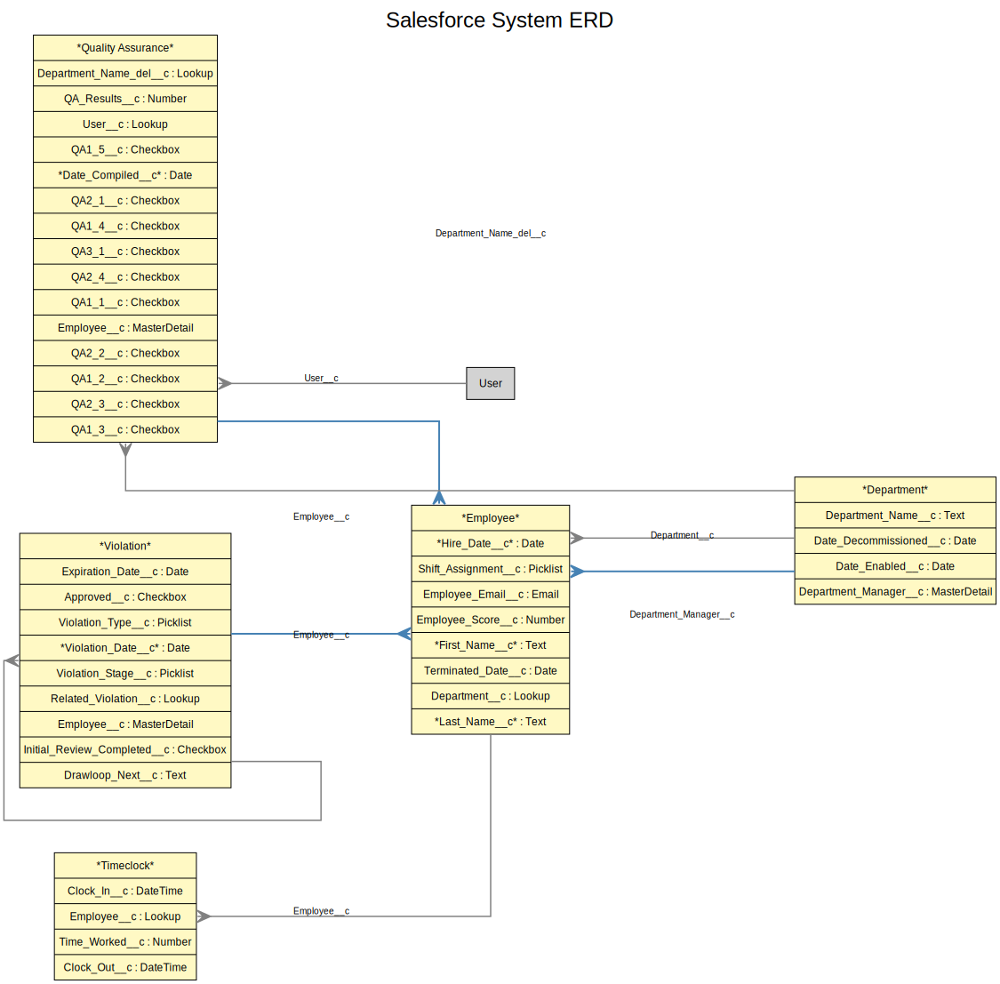

# Salesforce ERD Generator

This directory contains tools for generating Entity Relationship Diagrams (ERDs) from Salesforce Metadata.

## Overview

The ERD generator parses Salesforce object metadata and creates DOT (Graphviz) diagrams that can be rendered as images in multiple formats. It supports:

- **Standard Objects**: Salesforce standard objects (Account, Contact, etc.)
- **Custom Objects**: Project-specific custom objects (ending in `__c`)
- **Managed Package Objects**: Objects from installed managed packages
- **Relationships**: Master-Detail and Lookup relationships between objects

## Features

- **DOT/Graphviz Generation**: Creates DOT format diagrams that can be rendered using Graphviz
- **Multiple Image Formats**: Generates images in PNG, SVG, and PDF formats
- **Smart Object Selection**: Automatically selects the most connected objects for comprehensive diagrams
- **Field Display Control**: Option to show/hide fields and limit field count for readability
- **Multiple Layout Engines**: Support for different Graphviz layout engines (dot, neato, fdp, sfdp, circo, twopi)
- **Salesforce Styling**: Color-coded objects based on type:
  - Standard Objects: Light Blue (`#E1F5FE`)
  - Custom Objects: Light Yellow (`#FFF9C4`)
  - Managed Objects: Light Orange (`#FFE0B2`)

## Usage

### Prerequisites

- **Python 3.6+**: The script requires Python 3.6 or higher
- **Graphviz**: Must be installed on your system to generate images
  - macOS: `brew install graphviz`
  - Ubuntu: `sudo apt-get install graphviz`
  - Windows: Download from [graphviz.org](https://graphviz.org/download/)

### Basic Usage

```bash
# Generate ERD with default settings (top 15 objects, SVG format)
python erd_generator.py

# Generate diagram for specific objects
python erd_generator.py --objects Account Contact Service_Assignment__c

# Generate multiple image formats
python erd_generator.py --formats svg png pdf

# Limit ERD to top 30 objects
python erd_generator.py --max-objects 30

# Use different layout engine
python erd_generator.py --engine neato

# Hide fields for simpler view
python erd_generator.py --hide-fields
```

### Command Line Options

- `--objects-path`: Path to Salesforce objects directory (default: `../force-app/main/default/objects`)
- `--output-dir`: Output directory for generated files (default: `output`)
- `--objects`: Specific objects to include (default: auto-select top connected)
- `--max-objects`: Maximum number of objects in ERD (default: 15)
- `--formats`: Image formats to generate - png, svg, pdf (default: svg)
- `--filename`: Base filename for output files (default: final_erd)
- `--engine`: Graphviz layout engine - dot, neato, fdp, sfdp, circo, twopi (default: dot)
- `--width`: Image width in pixels (default: 1200)
- `--show-fields`: Show fields inside object boxes (default: True)
- `--hide-fields`: Hide fields inside object boxes (simpler view)
- `--max-fields-per-entity`: Limit number of fields shown per entity
- `--auto-limit-fields`: Automatically limit fields for large diagrams (default: True)

### Output Files

The generator creates the following output files:

1. **`{filename}.dot`**: DOT format file that can be used with Graphviz tools
2. **`images/{filename}.svg`**: Scalable vector graphics image (default)
3. **`images/{filename}.png`**: PNG image (if specified)
4. **`images/{filename}.pdf`**: PDF document (if specified)

All files are saved in the specified output directory with an `images/` subdirectory for image files.

## Example Output

### Generated ERD Diagram

Here's an example of a generated ERD diagram showing Salesforce objects and their relationships:



*Example ERD showing Account, Contact, and related custom objects with their relationships*

### DOT Diagram Structure

The generator creates DOT format diagrams with the following features:

- **Entity Boxes**: Objects are represented as record-shaped boxes with fields
- **Relationship Arrows**: Different arrow styles for Master-Detail vs Lookup relationships
- **Color Coding**: Objects are color-coded by type (Standard, Custom, Managed)
- **Field Display**: Shows relationship fields with required field indicators (*)
- **Layout Control**: Supports multiple Graphviz layout engines for different visual styles

## Object Types and Styling

| Object Type | Color | Usage |
|-------------|-------|-------|
| Standard Objects | Blue (`#D6E9FF`) | Salesforce standard objects like Account, Contact |
| Custom Objects | Yellow (`#FFF4C2`) | Project-specific custom objects ending in `__c` |
| Managed Objects | Orange (`#FFD8B2`) | Objects from installed managed packages |
| Main Objects | Red (`#FFB3B3`) | Primary objects in specific diagrams |

## Relationship Types

- **Master-Detail**: Strong parent-child relationships (solid arrows)
- **Lookup**: Reference relationships (solid arrows)

## Troubleshooting

### Common Issues

1. **No objects found**: Check that the `--objects-path` points to the correct Salesforce objects directory
2. **Permission errors**: Ensure the script has read access to the objects directory
3. **Missing relationships**: Some relationships may not be captured if referenced objects are not included in the analysis

### Performance Considerations

- Large orgs with many objects may take time to process
- Use `--max-objects` to limit the comprehensive ERD size
- Use `--objects` to focus on specific objects of interest

## Contributing

When modifying the ERD generator:

1. Maintain compatibility with existing styling standards
2. Test with various object types and relationship configurations
3. Update this README if adding new features
4. Ensure generated diagrams are readable and follow Salesforce conventions

## Related Files

- `erd_generator.py`: Main ERD generation script
- `ERD/`: Output directory for generated diagrams (when using default settings)
- `../force-app/main/default/objects/`: Salesforce object metadata source (default path)
